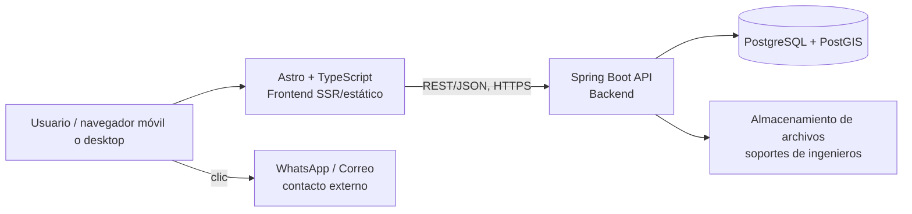
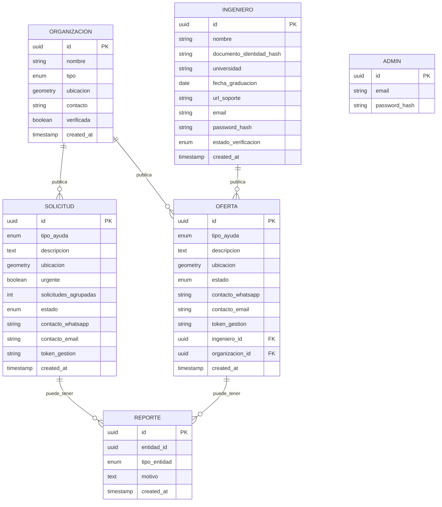

# Documento de Diseño Técnico
## Plataforma de Conexión de Ayuda Humanitaria — Terremoto Colombia (Chocó, agosto 2026)

**Versión:** 1.0 — MVP
**Stack base del equipo:** Astro + TypeScript (frontend), Java + Spring Boot (backend), PostgreSQL (persistencia)

---

## 1. Arquitectura de alto nivel



**Decisión clave de arquitectura:** el frontend y el backend se despliegan por separado (frontend estático/SSR en un CDN, backend como contenedor). Esto permite que el frontend cargue rápido incluso en conexiones lentas, y que el backend escale de forma independiente si un tipo de tráfico (por ejemplo, búsquedas por mapa) crece más que otro.

No hay app nativa ni modo offline en el MVP, así que no hay sincronización de datos que diseñar — toda operación asume conexión activa.

---

## 2. Stack tecnológico y justificación

| Capa | Tecnología | Por qué |
|---|---|---|
| Frontend | Astro + TypeScript | Ya lo maneja el equipo; genera HTML liviano por defecto, ideal para conexiones móviles lentas en zonas afectadas |
| Mapa | Leaflet + tiles de OpenStreetMap | Gratuito, sin necesidad de API key ni tarjeta de crédito (a diferencia de Google Maps, que exige facturación) |
| Backend | Spring Boot (Java) | Ya lo maneja el equipo; ecosistema maduro para REST + seguridad + validaciones |
| Base de datos | PostgreSQL + extensión **PostGIS** | SQL ya conocido por el equipo; PostGIS agrega consultas geoespaciales eficientes (radio, distancia) que de otro modo habría que programar a mano y de forma lenta |
| Autenticación | Spring Security + JWT | Solo dos roles la necesitan (ingenieros y administradores); JWT evita manejar sesiones con estado, más simple de desplegar gratis |
| Almacenamiento de archivos | Bucket gratuito (Cloudflare R2 / Supabase Storage) | Para las fotos de soporte profesional de los ingenieros; no conviene guardarlas en la base de datos |
| Notificación de contacto | Enlaces directos `wa.me/<numero>` y `mailto:` | No requiere infraestructura de mensajería propia; cero costo |

---

## 3. Modelo de datos



**Notas de diseño:**
- `ubicacion` es tipo `geometry(Point, 4326)` de PostGIS — permite consultas de distancia nativas y rápidas.
- `token_gestion` es un código aleatorio enviado al creador de una solicitud/oferta (por URL) que le permite marcarla como "atendida" sin necesidad de login.
- `documento_identidad_hash`: el número de documento del ingeniero **no se guarda en texto plano**; se guarda un hash para poder detectar duplicados sin exponer el dato real. El documento de soporte (foto) sí se guarda, pero en almacenamiento con acceso restringido solo a administradores.
- `solicitudes_agrupadas` es un contador que se actualiza cuando el sistema detecta nuevas solicitudes dentro del radio de 100 m (ver sección 5).

---

## 4. Diseño de la API (REST)

| Método | Ruta | Auth | Descripción |
|---|---|---|---|
| POST | `/api/solicitudes` | No | Crear solicitud de ayuda. Devuelve `id` + `token_gestion`. |
| GET | `/api/solicitudes?lat&lng&radio&tipo` | No | Buscar solicitudes activas cerca de un punto. |
| PATCH | `/api/solicitudes/{id}/atendida?token=` | No (requiere token) | Marcar solicitud como atendida. |
| POST | `/api/ofertas` | No | Crear oferta de ayuda. |
| GET | `/api/ofertas?lat&lng&radio&tipo` | No | Buscar ofertas activas cerca de un punto. |
| PATCH | `/api/ofertas/{id}/atendida?token=` | No (requiere token) | Marcar oferta como atendida/cerrada. |
| POST | `/api/organizaciones` | No | Autoregistrar organización/centro de acopio. |
| POST | `/api/ingenieros/registro` | No | Registrar ingeniero + subir soporte (multipart). Queda en estado `pendiente`. |
| POST | `/api/auth/login` | No | Login de ingeniero o administrador (devuelve JWT). |
| POST | `/api/reportes` | No | Reportar una publicación (solicitud u oferta). |
| GET | `/api/admin/ingenieros/pendientes` | JWT (admin) | Listar ingenieros pendientes de verificación. |
| PATCH | `/api/admin/ingenieros/{id}/estado` | JWT (admin) | Aprobar o rechazar un ingeniero. |
| DELETE | `/api/admin/publicaciones/{id}` | JWT (admin) | Eliminar una solicitud/oferta reportada o fraudulenta. |
| GET | `/api/admin/reportes` | JWT (admin) | Ver publicaciones reportadas pendientes de revisión. |
| GET | `/api/estadisticas/publicas` | No | Conteos agregados por tipo/zona, sin datos personales, para la página de transparencia. |

---

## 5. Algoritmo de geolocalización, urgencia y agrupación de duplicados

### Lo que pidieron
> "Si se hacen más de 3 solicitudes se marcará como urgente; de ahí en adelante se hace caso omiso a solicitudes en un rango de 100 m."

### Ajuste propuesto y por qué

Ignorar por completo las solicitudes adicionales pierde información real (cuánta gente necesita algo en esa zona), y complica saber cuándo dejar de ser "urgente" si luego bajan las solicitudes. Propongo en su lugar una lógica de **agrupación con contador visible**, que logra el mismo objetivo (no saturar el mapa de pines) sin perder datos:

1. Al crear una solicitud, el backend ejecuta una consulta PostGIS `ST_DWithin` para buscar solicitudes **activas, del mismo tipo de ayuda**, en un radio de 100 metros.
2. Si existen 3 o más (incluyendo la nueva), se agrupan bajo el registro más antiguo del clúster:
   - Se incrementa `solicitudes_agrupadas` en ese registro.
   - Se marca `urgente = true`.
   - Las nuevas solicitudes del clúster se guardan igual (para no perder el dato ni el contacto de cada persona), pero el **mapa solo muestra un pin** por clúster, con la etiqueta "🔴 Urgente — 8 solicitudes similares".
3. Si un voluntario abre ese pin, puede ver el listado completo de solicitudes agrupadas (con sus contactos), no solo la primera.
4. Si las solicitudes del clúster se van marcando como "atendidas" (vía `token_gestion`), el contador baja y el pin deja de mostrarse como urgente cuando quedan menos de 3 activas.

```
pseudocódigo:
al crear_solicitud(nueva):
    cercanas = SELECT * FROM solicitudes
                WHERE tipo_ayuda = nueva.tipo_ayuda
                AND estado = 'activa'
                AND ST_DWithin(ubicacion, nueva.ubicacion, 100) -- metros
    guardar(nueva)
    total = count(cercanas) + 1
    if total >= 3:
        marcar_urgente(cluster = cercanas + nueva)
```

Este enfoque es más barato de calcular que un clustering geoespacial complejo (tipo k-means), corre bien con un índice espacial de PostGIS (`GIST`), y es explicable a un usuario final sin tecnicismos.

---

## 6. Autenticación y autorización

Solo dos roles requieren login: **ingeniero/asesor estructural** y **administrador**. El resto de la plataforma es de acceso público sin sesión.

- Spring Security + JWT (sin sesiones con estado, ideal para desplegar en capas gratuitas sin sticky sessions).
- Roles: `ROLE_INGENIERO`, `ROLE_ADMIN`.
- Un ingeniero puede iniciar sesión y publicar ofertas **aunque su verificación esté pendiente**, pero su oferta se muestra con la etiqueta "⏳ Pendiente de verificación" hasta que un administrador la apruebe — así no se bloquea su participación mientras se revisa el soporte, pero tampoco se genera falsa confianza.
- Contraseñas con `BCryptPasswordEncoder`.
- Rutas `/api/admin/**` protegidas exclusivamente para `ROLE_ADMIN`.

---

## 7. Confianza y anti-fraude (recomendación para el punto que quedó abierto)

Dado que **no habrá registro para damnificados ni voluntarios**, no se puede validar identidad de forma tradicional. Propongo un modelo de confianza basado en señales, no en identidad:

1. **Botón de "Reportar"** visible en cada publicación pública. Cualquier reporte entra a una cola de revisión del panel admin.
2. **Confirmación de cierre:** cuando alguien marca su solicitud como "atendida", se le pregunta opcionalmente "¿Quién te ayudó?" — dato útil solo para estadísticas internas, no público.
3. **Límite de publicaciones por IP/dispositivo** en una ventana corta de tiempo (por ejemplo, máximo 5 publicaciones cada 10 minutos desde el mismo origen), para frenar spam automatizado sin afectar el uso normal.
4. **Insignia "Organización verificada"**: los administradores pueden marcar manualmente como verificadas a organizaciones conocidas (Cruz Roja, Defensa Civil, centros de acopio confirmados), mostrando un ícono distintivo — el resto de organizaciones autoregistradas aparecen sin esa insignia, pero no se bloquean.
5. Este modelo **no impide el fraude al 100%**, pero es proporcional al objetivo de mantener la fricción mínima; el control fuerte se reserva solo para el caso de mayor riesgo físico real: los ingenieros estructurales (verificación manual obligatoria, sección 6).

---

## 8. Privacidad y cumplimiento (Ley 1581 de 2012)

| Dato | Clasificación | Tratamiento |
|---|---|---|
| Ubicación de solicitud/oferta | Dato personal | Se muestra públicamente de forma aproximada (no la dirección exacta), suficiente para georreferenciar sin exponer el domicilio preciso |
| WhatsApp / correo de contacto | Dato personal | Visible públicamente solo si el usuario decide incluirlo (checkbox de consentimiento explícito al publicar) |
| Documento de identidad, universidad, fecha de graduación del ingeniero | Dato personal / sensible en cuanto a su tratamiento | No se expone públicamente; solo visible para administradores en el flujo de verificación; documento hasheado, foto de soporte en almacenamiento restringido |
| Estadísticas públicas | Dato agregado/anónimo | Sin datos personales, solo conteos por tipo y zona |

Elementos mínimos de cumplimiento a implementar:
- Texto breve de **autorización de tratamiento de datos** (checkbox) en los formularios de publicación e ingenieros, enlazando a una política de privacidad simple.
- Posibilidad de que cualquier persona solicite la eliminación de su publicación (vía el mismo `token_gestion`, o escribiendo al correo del equipo administrador).
- Acceso a datos sensibles (documento de ingenieros) restringido por rol (`ROLE_ADMIN`) y registrado en log de auditoría (quién vio o aprobó qué, y cuándo).
- Cifrado en tránsito (HTTPS obligatorio) y en reposo para el bucket de soportes.

---

## 9. Flujo de contacto externo

No hay chat interno. Al publicar, el usuario decide qué compartir:

- Si deja WhatsApp: el sistema genera un botón `https://wa.me/57XXXXXXXXXX` que abre WhatsApp directamente con un mensaje prellenado ("Hola, vi tu publicación en [plataforma] sobre...").
- Si deja correo: botón `mailto:` con asunto prellenado.
- El número/correo se muestra tal cual en la publicación (no hay forma de ocultarlo y aun así permitir contacto directo, dado que no hay chat propio) — esto debe quedar explícito en el formulario de publicación para que el usuario decida conscientemente qué compartir.

---

## 10. Infraestructura y despliegue (capa gratuita)

| Componente | Proveedor recomendado | Motivo |
|---|---|---|
| Frontend (Astro) | **Vercel** o **Netlify** | Despliegue automático desde GitHub, capa gratuita generosa, CDN global incluido |
| Backend (Spring Boot, como contenedor Docker) | **Fly.io** o **Railway** | Ambos soportan contenedores Java sin configuración compleja; Fly.io tiene capa gratuita permanente por app, Railway da crédito mensual gratuito |
| Base de datos PostgreSQL + PostGIS | **Supabase** | Postgres gestionado gratuito con PostGIS habilitable con un clic; también sirve como almacenamiento de archivos (soportes de ingenieros) en el mismo proyecto |
| Dominio | Subdominio gratuito del proveedor elegido, o dominio propio si ya tienen uno | Para lanzar en 3 días no es crítico tener dominio propio desde el día 1 |
| CI/CD | GitHub Actions (incluido gratis en repos públicos/privados con límite generoso) | Despliegue automático al hacer push a `main` |

**Advertencia importante:** los planes gratuitos de backend suelen "dormir" el contenedor tras inactividad (cold start de varios segundos en la primera petición). Para el lanzamiento, vale la pena hacer una prueba de carga simple el día anterior y, si el cold start es un problema, configurar un ping periódico (cron externo gratuito, por ejemplo desde GitHub Actions) que mantenga el backend despierto en las horas de mayor uso esperado.

---

## 11. Escalabilidad para 1.000 usuarios concurrentes

- Índice espacial `GIST` sobre la columna `ubicacion` en PostgreSQL/PostGIS — imprescindible para que las búsquedas por radio no degraden con el volumen.
- Pool de conexiones (`HikariCP`, ya incluido por defecto en Spring Boot) configurado con un tamaño razonable acorde al límite de conexiones del plan gratuito de Supabase.
- Backend sin estado (stateless, gracias a JWT) — permite escalar horizontalmente sin problema si más adelante se necesitan varias instancias.
- Rate limiting básico a nivel de API (por ejemplo con un filtro de Spring o un middleware simple) para evitar que un solo origen sature el backend.
- Frontend estático/SSR servido desde CDN — la mayor parte de la carga real recae en el backend y la base de datos, no en el frontend.

---

## 12. Panel de administración

Pantallas mínimas del MVP:

1. **Ingenieros pendientes:** lista con nombre, universidad, fecha de graduación, enlace al soporte subido, y botones Aprobar/Rechazar.
2. **Publicaciones reportadas:** lista con motivo del reporte, contenido de la publicación, y botón Eliminar/Descartar reporte.
3. **Estadísticas:** conteo de solicitudes/ofertas activas y atendidas por tipo y zona, exportable a CSV para reportes de transparencia.
4. **Organizaciones:** lista de organizaciones autoregistradas, con opción de marcar como "verificada".

---

## 13. Plan de implementación en 3 días

**Día 1 (hoy):**
- Definir modelo de datos final y migraciones iniciales.
- Levantar proyecto Spring Boot (estructura base, conexión a Supabase, entidad `Solicitud`/`Oferta` con PostGIS).
- Levantar proyecto Astro con landing "Ayudar / Solicitar ayuda".
- Endpoints básicos: crear y listar solicitudes/ofertas (sin lógica de urgencia todavía).

**Día 2 (mañana — versión funcional para publicar):**
- Mapa con Leaflet mostrando pines de solicitudes/ofertas cercanas.
- Formularios de publicación con geolocalización del navegador.
- Lógica de agrupación/urgencia (sección 5), versión simple primero.
- Despliegue a producción (Vercel + Fly.io/Railway + Supabase) y pruebas manuales en móvil.

**Día 3 (lanzamiento oficial):**
- Módulo de ingenieros: registro + subida de soporte + estado pendiente.
- Panel de administración mínimo (aprobar ingenieros, ver reportes, eliminar publicaciones).
- Botón de "Reportar" y `token_gestion` para marcar como atendida.
- Página pública de estadísticas.
- Prueba de carga ligera y ajustes finales antes de anunciar el lanzamiento.

---

## 14. Roadmap post-MVP (no bloquea el lanzamiento)

- Modo de baja conectividad / PWA instalable, dado que hay zonas reales sin señal estable.
- Canal alterno vía WhatsApp Business API o SMS para quienes no tengan datos móviles.
- Integración con UNGRD u otras entidades oficiales si se formaliza una alianza.
- Verificación semi-automatizada de ingenieros (validación contra bases de datos de consejos profesionales, si existen APIs públicas).
- Accesibilidad (lectores de pantalla, alto contraste) y soporte a lenguas indígenas de la región afectada.
- Migración de infraestructura gratuita a un plan pago con mayor garantía de disponibilidad, una vez pase el pico de la emergencia.
